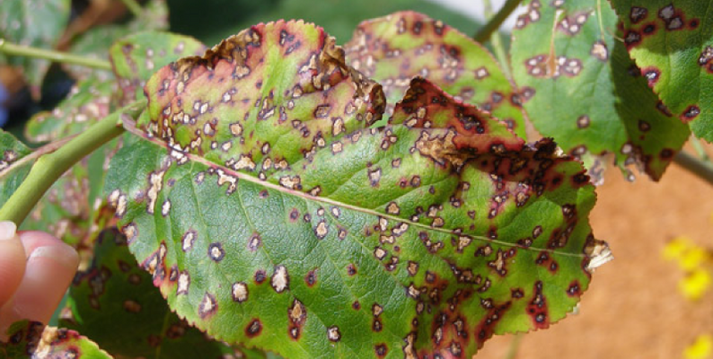
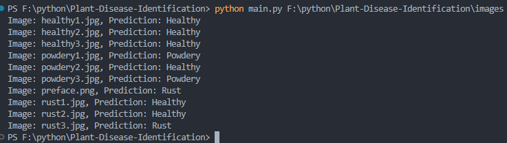

# Plant-Disease-Identification



## Project Overview

Smart Agriculture Project Based on Deep Learning-Plant Disease Detection. By building a CNN model, we can predict the current health status of the plant: healthy, powdery, and rusty.

## CNN Models

The dataset for this project comes from Kaggle(https://www.kaggle.com/datasets/rashikrahmanpritom/plant-disease-recognition-dataset). Due to the size of the dataset, I did not upload it to GitHub. Regarding the CNN model, I used three depths of res-net (residual network). The structure of the model is derived from related papers. The detailed implementation can be viewed in my other git repository.(https://github.com/JustinMei0531/CNN-Models)

Following are the details of the model:

| Model      | Training Epochs | Accuracy on Test Dataset |             Trained Model              |
| ---------- | --------------- | ------------------------ | :------------------------------------: |
| res-net34  | 15              | 93%~95%                  | resnet34-plant-disease-recognition.pt  |
| res-net50  | 10              | 95%~97%                  | resnet50-plant-disease-recognition.pt  |
| res-net101 | 8               | 89%~92%                  | resnet101-plant-disease-recognition.pt |

## Installation and Workflow

### 1. Dataset Preparation

This step is necessary if you want to reuse the dataset. After performing these steps, the dataset will be downloaded locally and its structure will be changed.

1. Clone the repository to local: `git clone https://github.com/JustinMei0531/Plant-Disease-Identification`.
2. Enter the project folder.
3. Install the required dependencies: `pip install -r requirements.txt`.
4. Open a terminal and run this command: `kaggle datasets download -d rashikrahmanpritom/plant-disease-recognition-dataset`.
5. Execute "make_datasets.py": `python make_datasets.py`

### 2. Model  Training

I implemented three types of residual networks in the model.py file. In the model_training.py file, you can select the model you want to train. In the previous version, I provide three trained models, but due to the size limit of GitHub upload files, I split them into several parts. For specific operations, please refer to Part 6.

Execute "model_training.py": `python model_training.py`

### 3. Model Test

Execute "model_test.py": `python model_test.py`

### 4. Model Validation

Execute "model_validation.py": `python model_validation.py`

### 5. Final Use Method

This project can predict all the images in a folder. Just specify the folder path:

```shell
python main.py your_folder_path
```

### 6. Use Pre-trained Models
Execute "utils.py": `python utils.py`

## Final Effect
There is an images folder under the project folder, which contains several plant disease pictures from Google images. You can use it as a test.

The results shown in the picture are run on vscode.